# 🎮 GamePlatform — Игровой портал на Flask

Игровая веб-платформа с тремя классическими играми (Судоку, Динозаврик, Тетрис), системой авторизации, рейтингов, административной панелью и социальными функциями.

---

## 🚀 Технологии

- **Backend**: Python 3.12, Flask 2.3.3, Flask-Login, Flask-SQLAlchemy
- **База данных**: MySQL 8.0, SQLAlchemy ORM
- **Frontend**: HTML5, CSS3, Bootstrap 5, JavaScript (ES6), Chart.js
- **Инструменты**: Git, GitHub, ERwin, Draw.io, BPwin

---

## 🎮 Игры

| Игра | Описание |
|------|----------|
| **Судоку** | Классическая головоломка. Доступны размеры: 4×4 и 6×6. |
| **Динозаврик** | Бесконечный раннер. Управление пробелом, скорость растёт со временем. |
| **Тетрис** | Классическая головоломка. Управление стрелками, скорость падения растёт с каждыми 500 очками. |

---

## 👥 Возможности

- ✅ Регистрация и авторизация с хешированием паролей (Werkzeug)
- ✅ Разделение ролей: **пользователь** и **администратор** (декоратор `@admin_required`)
- ✅ Система рейтингов – сохранение результатов в базу данных
- ✅ Личная статистика по каждой игре (количество партий, рекорд, средний счёт, последние 5 результатов)
- ✅ Серии заходов (streak) – поощрение за ежедневные посещения
- ✅ Глобальная таблица ТОП‑5 рекордов с кликабельными ссылками на профили
- ✅ Комментарии на стене профиля пользователя (с возможностью удаления)
- ✅ Админ-панель:
  - сводная статистика (пользователи, администраторы, игры, комментарии)
  - управление пользователями (поиск, смена роли, удаление)
  - графики (топ‑5 игроков, распределение партий по играм с процентами)
- ✅ Загрузка аватаров, смена пароля, удаление аккаунта
- ✅ Адаптивный дизайн (Bootstrap 5)
- ✅ Документация проекта (страница `/docs`)

---

## 📸 Скриншоты

### Главная страница до авторизации
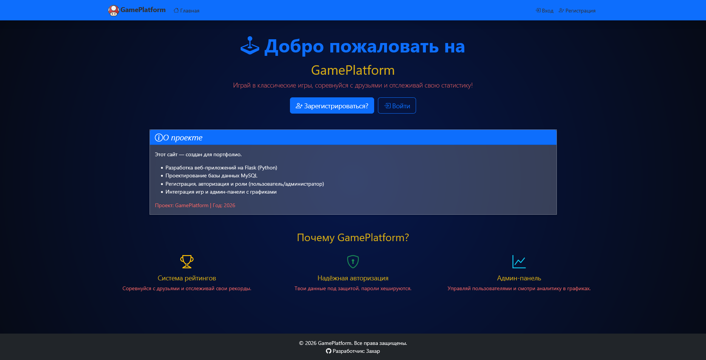

### Главная страница
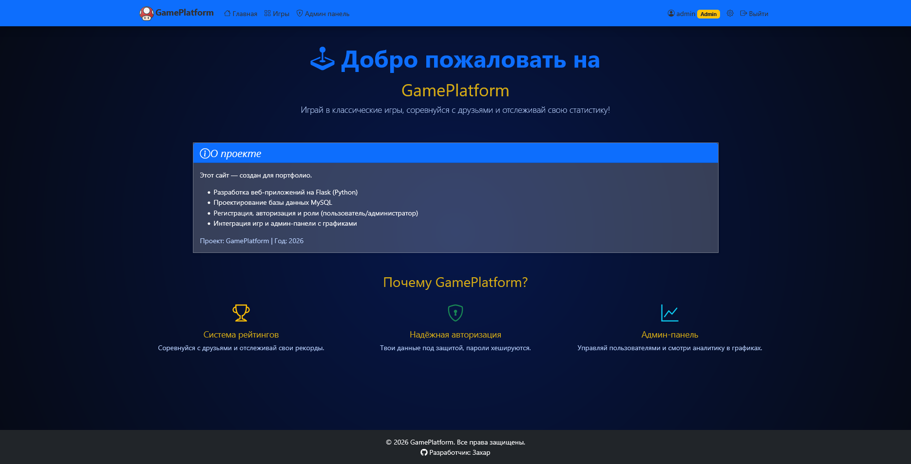

### Страница регистрации
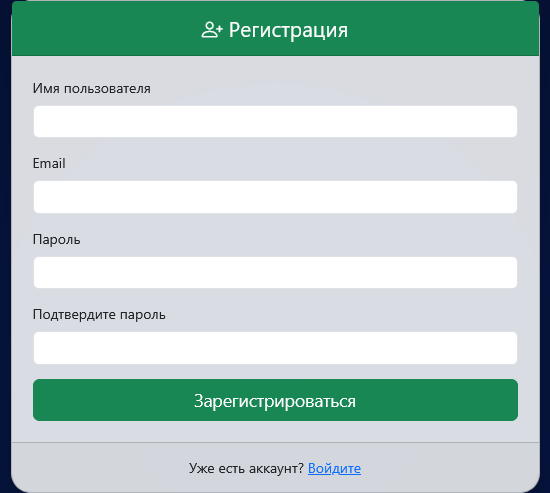

### Страница со списком игр и таблица рекордов
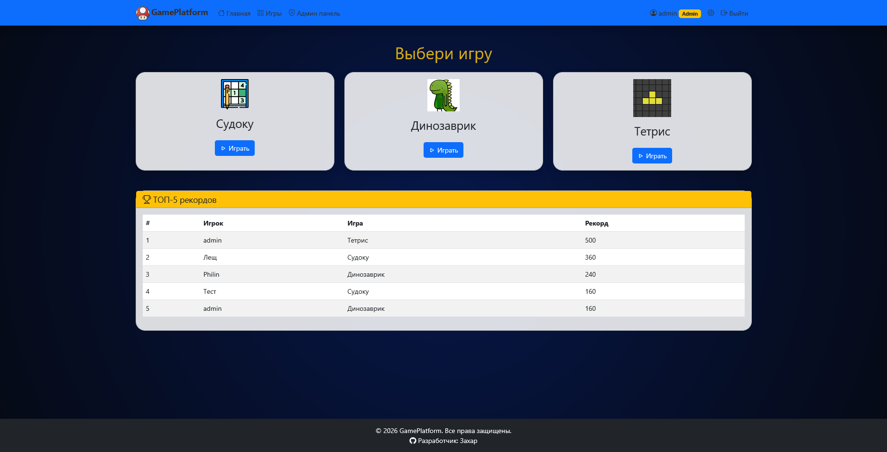

### Профиль пользователя
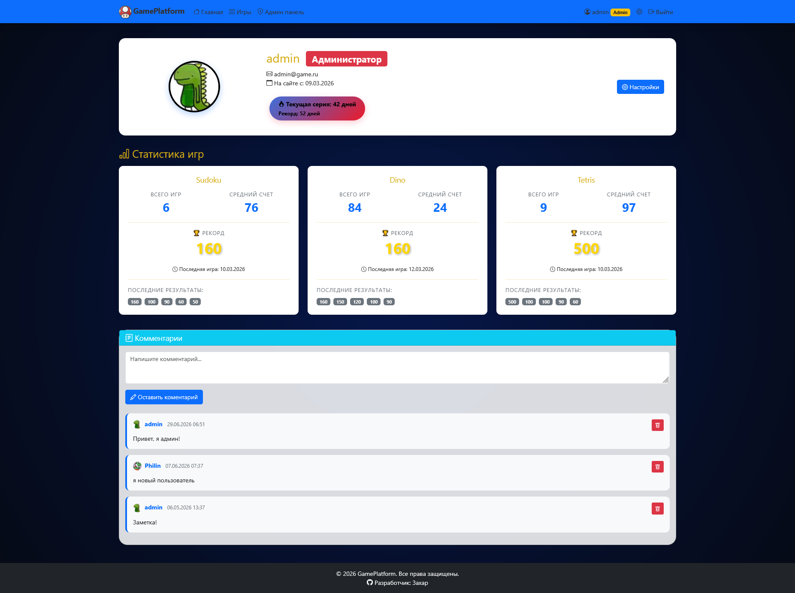

### Игровой процесс «Тетрис»
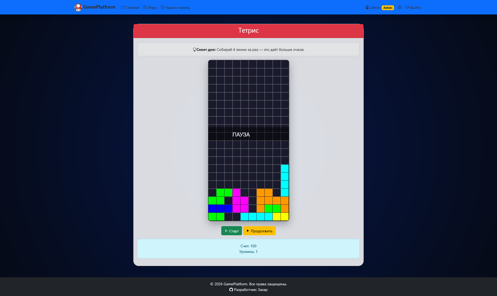

### Игровой процесс «Судоку»
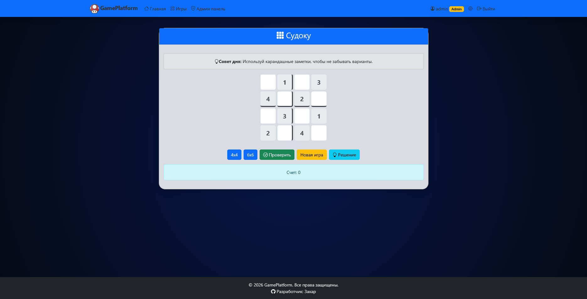

### Игровой процесс «Динозаврик»
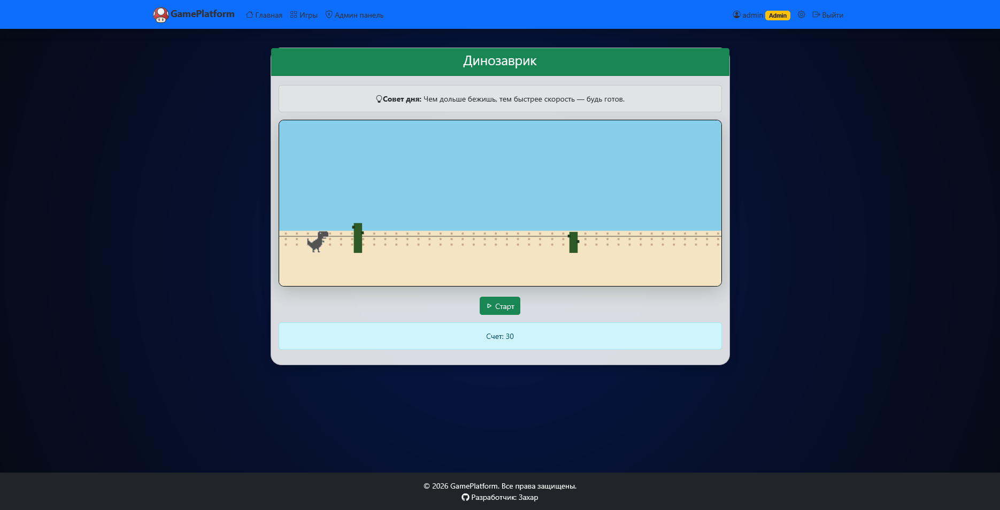

### Админ-панель 
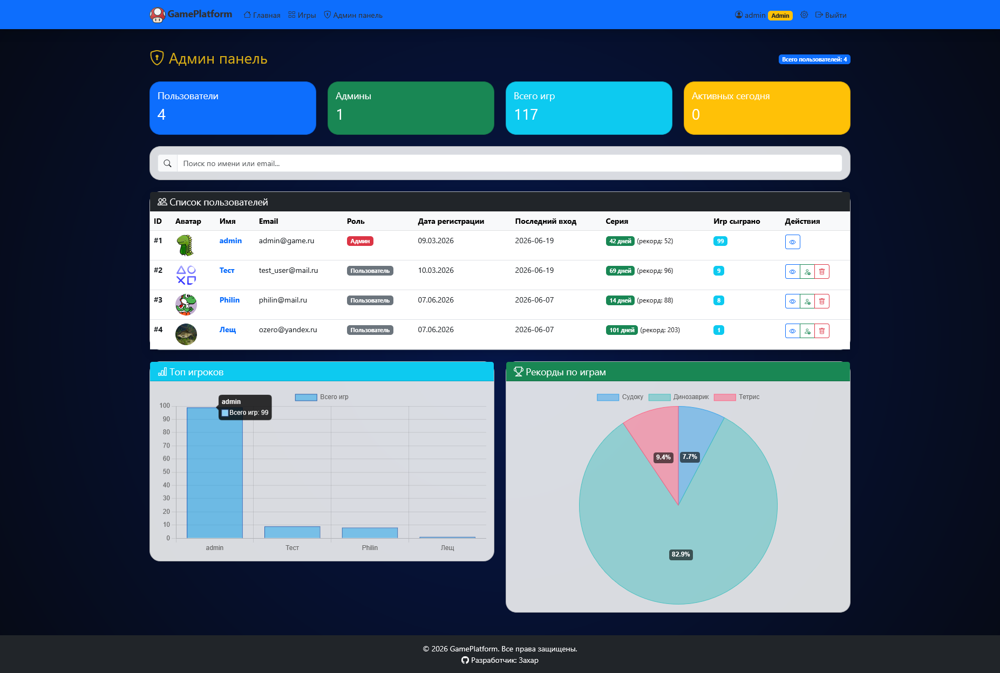

### Админ-панель – графики


### Настройки
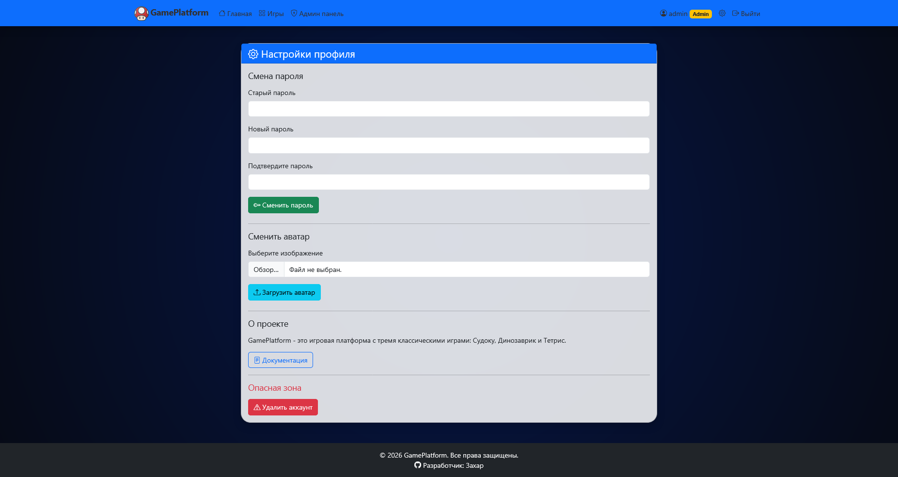

### Документация
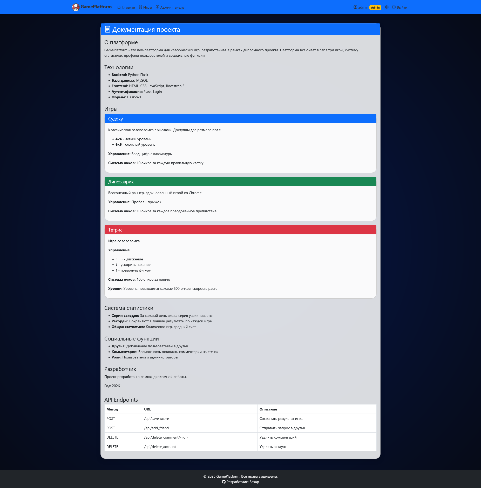

---

## 🔧 Установка и запуск (локально)

### 1. Клонировать репозиторий

```bash
git clone https://github.com/BlueLock-wasd/game-platform.git
cd game-platform

2. Создать виртуальное окружение
python -m venv venv
source venv/bin/activate      # Linux/Mac
# или
venv\Scripts\activate         # Windows

3. Установить зависимости
pip install -r requirements.txt

4. Настроить базу данных MySQL
Создать базу game_platform
Проверить/отредактировать config.py (логин, пароль)

5. Инициализировать базу данных
python init_db.py

6. Запустить приложение
python app.py

🔑 Тестовый доступ
Роль	Логин	Пароль
Администратор	admin	admin123

game-platform/
├── app.py                 # главный файл (маршруты, бизнес-логика)
├── models.py              # модели базы данных
├── forms.py               # формы для регистрации / входа / смены пароля
├── init_db.py             # инициализация БД и создание администратора
├── requirements.txt       # зависимости
├── config.py              # конфигурация (секретный ключ, подключение к БД)
├── templates/             # HTML-шаблоны (base, index, games, profile, admin...)
├── static/                # стили (CSS), скрипты игр (JS), изображения, аватары
├── screenshots/           # скриншоты для README (опционально)
└── README.md              # этот файл

📄 Лицензия
Автор: Захар (BlueLock-wasd)
Последнее обновление: июнь 2026 г.